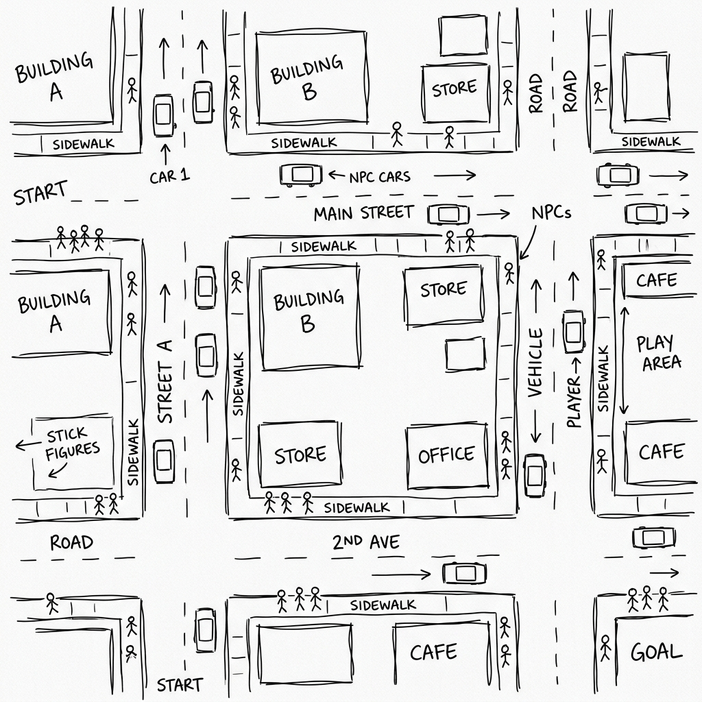

# Pixel Crime City (Vanilla JS Videogame)

## 📖 Game Description
Pixel Crime City is an action-packed, top-down open-world game inspired by classic retro crime games. Survive in a dynamic city filled with pedestrians, traffic, police chases, and unpredictable weather! 

**Entities included in the game:**
- **Player:** The main character you control.
- **Vehicles:** Civilian cars, Police Cruisers, Ambulances, and Firetrucks.
- **NPCs (Non-Player Characters):** Citizens, Police Officers, Medics, and Firefighters.
- **Projectiles:** Bullets from guns.
- **Environment:** Buildings, Roads, Streetlights.

*(Excalidraw sketch below)*

## 🎮 How to Play

### Objective
Cause as much chaos as possible to increase your score without getting wasted! Steal cars, avoid the police, and survive the ever-escalating Wanted Level.

### Win/Lose Conditions
- **Win:** There is no traditional "Win". The goal is to survive as long as possible and beat your High Score.
- **Lose:** If your health (HP) reaches 0 (either by being run over, shot, or caught in an explosion), you are **WASTED**, and the game is over.

### Controls
- **W, A, S, D:** Move character / Drive vehicle
- **Shift:** Sprint (when on foot)
- **F:** Enter / Exit a vehicle
- **E:** Pick up dropped weapons
- **Space:** Punch / Shoot (when on foot) / Handbrake (when driving)

## ⚙️ Tech Decisions

**Functional Architecture (Data-Driven Approach)**
Instead of strictly object-oriented classes (`class Player`, `class Car`), this game utilizes a **Functional/Data-Oriented** architecture. 
- **Entities are simple objects:** `const player = { x: 50, y: 50, hp: 100 }`. Arrays hold lists of objects (`const vehicles = []`).
- **Behavior is in functions:** Functions like `updatePlayer(dt)` and `updateVehicles(dt)` iterate over the state arrays every frame.
- **Why?** In a JavaScript game loop running 60 times a second, dealing with thousands of particles (rain, sparks) and entities is much faster and simpler when logic is decoupled from state. It completely avoids `this` binding issues in event listeners and makes rendering predictable.

## 🔗 Project Links
- **Play the Game (GitHub Pages):** [https://umutcff.github.io/GTA-UmidV/](https://umutcff.github.io/GTA-UmidV/)
- **AI Development Log:** [Read the AI_DIARY.md](./AI_DIARY.md)

## 🐛 Known Bugs & Next Steps
- **Known Bugs:**
  - Occasionally, civilian cars might get stuck trying to navigate tight corners around buildings.
  - When driving extremely fast, the player can sometimes clip slightly into building borders before the collision resolves.
- **What I'd Fix Next:**
  - Add a functional minimap to track police and hospitals.
  - Implement a shop system to spend the accumulated score/money on better weapons.
